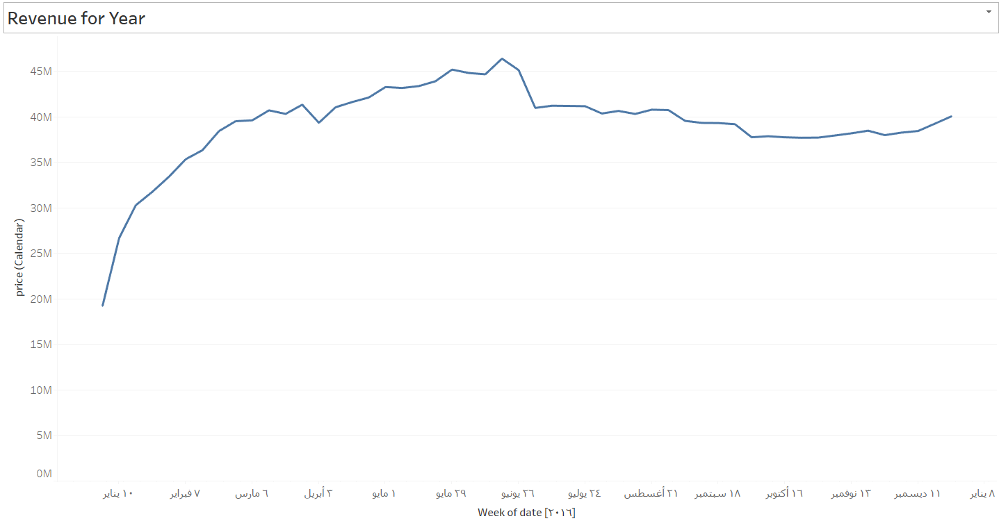

# Portfolio Projects
## Following are my projects in SQL, Python, Tableau & Excel:  
#### You can take a look at my personal on Github : [Data analysi on Github]([www.priyankajha24.wixsite.com/aboutme](https://github.com/raidaljabri/Data-Analysis.git))  

#### You can also take a look at my Linkedin : [PriyankaJhaTheAnalyst](h)  

- [x] *Tableau* - 

To view these Tableau Dashboards in Tableau Public, click on the hypertext link.
  1 project
- Booking Hotel Data Analysis (4 Dashboards): 
      

      2 Revenue for Year
      
**Revenue for Year**  
   

      3 Distinct count of badroom listings
      
**Distinct count of bedroom listings**  
   

   
      4 price by zd cood
      
**Price by zd code**  
   

     

